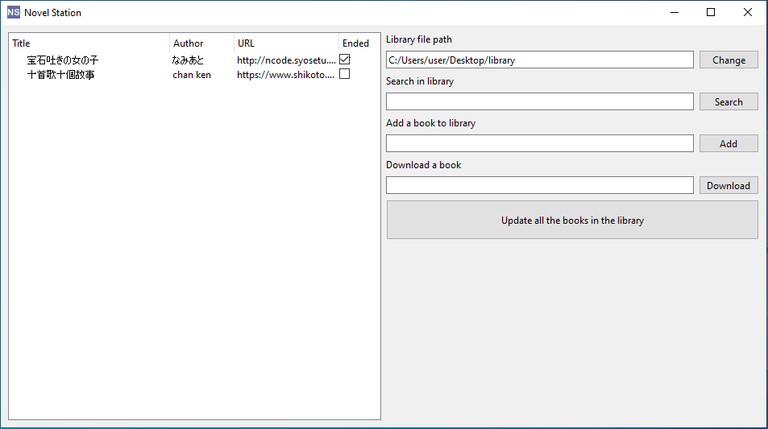

# novel-station
A novel downloader and manager for online novel sites.

## Overview
This program offers a user-friendly graphical user interface (GUI) for downloading and managing online novels. The downloaded novels are stored in HTML format. The program uses a configuration file ```library.json``` to manage the storage path and book information.

## Supported sites
1. [小説家になろう](https://syosetu.com/)
2. [紙言](www.shikoto.com)

## Screenshot


## Installation

### Option 1: Download the executable binary
Visit the [Release Page](https://github.com/makercyf/novel-station/releases) and download the latest executable binary. Run the binary to launch the program.

**Note:** There is a false positive alarm of virus checking. The executable binary is compiled with [Nuitka in the GitHub Action environment](https://github.com/makercyf/novel-station/actions/workflows/main.yml), and a sha256 checksum is provided for verification. If you have concerns about viruses, you can follow the instructions below to run from the source. Also, I strongly encourage users to review the code before using someone else's application.

### Option 2: Run from source
1. Clone the repository to your local machine:
```
git clone https://github.com/makercyf/novel-station.git
```
2. Navigate to the project directory:
```
cd novel-station
```
3. Install the required dependencies:
```
pip install -r requirements.txt
```

## Usage
Run the program:
- If using the executable binary, click the application to start the program.
- If running from source, run the python file directly using the command ```python main.py```

### Remarks
1. Managing the book: Double-clicking on a book item will open its corresponding folder, while right-clicking on the book item will trigger a context menu, providing an option to delete the book from the library. Notice that the downloaded content will **not** be deleted.
2. Download limit: It is advised to download a small amount of chapters first, since the website may restrict your access if a large volume of requests is made in a short time. After that, you may try to increase the download amount to test its access limit in a certain time range.

## Configuration
The ```library.json``` file is crucial for maintaining user preferences and book information. Here is an example structure:
```json
{
    "path": "C:/Users/user/Desktop/library",
    "library": [
        {
            "title": "宝石吐きの女の子",
            "author": "なみあと",
            "url": "http://ncode.syosetu.com/n4843br/",
            "ended": "✔",
            "lastDownload": 0,
            "appendChapterNum": null
        },
        {
            "title": "十首歌十個故事",
            "author": "chan ken",
            "url": "https://www.shikoto.com/articles/275046.html",
            "ended": "",
            "lastDownload": 0,
            "appendChapterNum": null
        }
    ]
}
```
## License
This project is licensed under the MIT License.
